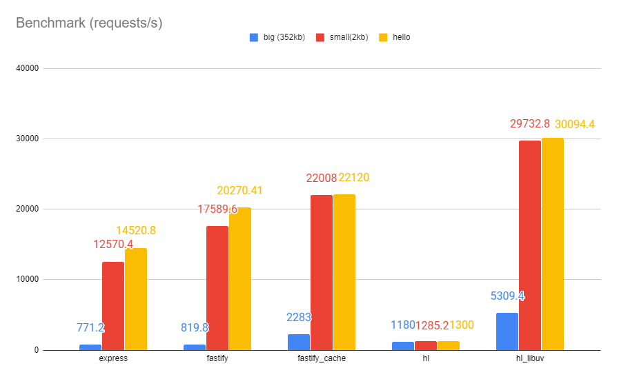

<p align="center">
    
</p>

WebLink
======
Linking [Hashlink](https://github.com/HaxeFoundation/hashlink) and other [targets](#targets) to the role of a webserver.

```haxe
class Main {
    function main() {
        var app = new weblink.Weblink();
        app.get(function(request,response)
        {
            response.send("HELLO WORLD");
        });
        app.listen(2000);
    }
}
```

Features
====
* Uses [libuv](https://github.com/libuv/libuv)
* Minimal and concise with express lib in mind
* No dependencies, and easy integration
* Extremely fast, roughly 4x faster than Fastify with big data, and 2x with small [Benchmark](#benchmark)


Getting Started
====

Install dev version:
```
haxelib git weblink https://github.com/PXshadow/weblink
```
Include in build.hxml
```
-lib weblink
```

# Targets
*requires libuv (asys in the future)*
* hashlink (uses libuv)
* more targets in the future using [asys](https://github.com/HaxeFoundation/haxe-evolution/blob/7371439061fcb30f60f21369701a5e599dfa802c/proposals/0010-asys.md)

# Benchmark

[<p align="left"></p>](https://github.com/PXshadow/weblinkBenchmark)

Supported
====
- [methods](https://developer.mozilla.org/en-US/docs/Web/HTTP/Methods)
    - [x] GET
    - [x] POST
    - [ ] OPTIONS
    - [x] HEAD
    - [x] PUT
- [encoding](https://developer.mozilla.org/en-US/docs/Web/HTTP/Compression)
    - [ ] gzip
    - [ ] compress
    - [ ] deflate
    - [ ] br
- caching
    - [ ] age
    - [ ] expires
- extra
    - [x] [content type](https://developer.mozilla.org/en-US/docs/Web/HTTP/Headers/Content-Type)
    - [ ] [cors](https://developer.mozilla.org/en-US/docs/Web/HTTP/CORS)
    - [x] bytes (png image for instance)
    - [x] [redirects](https://developer.mozilla.org/en-US/docs/Web/HTTP/Redirections)
    - [ ] [cookies](https://developer.mozilla.org/en-US/docs/Web/HTTP/Cookies)
    - [ ] ssl (haxe 4.2) 
    - [ ] [cert bot](https://certbot.eff.org/) easy integration
    - [x] serve web content (files ex: html/images/sounds)
    - [ ] connection public ip (haxe 4.2)

# Contributing

1. Fork
2. Clone and setup
3. Configure VSCode :

    Add that in .vscode/launch.json : 
    
    ```
    {
        // Use IntelliSense to learn about possible attributes.
        // Hover to view descriptions of existing attributes.
        // For more information, visit: https://go.microsoft.com/fwlink/?linkid=830387
        "version": "0.2.0",
        "configurations": [
            {
                "name": "HashLink (launch)",
                "request": "launch",
                "type": "hl",
                "cwd": "${workspaceFolder}",
                "preLaunchTask": {
                    "type": "haxe",
                    "args": "active configuration"
                }
            },
            {
                "name": "HashLink (attach)",
                "request": "attach",
                "port": 6112,
                "type": "hl",
                "cwd": "${workspaceFolder}",
                "preLaunchTask": {
                    "type": "haxe",
                    "args": "active configuration"
                }
            }
        ]
    }
    ```
4. Develop (and press F5 to launch hashlink)
5. Pull request
